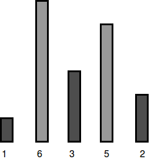

# The Hurdle Race  - Hackerank

A video player plays a game in which the character competes in a hurdle race. Hurdles are of varying heights, and the characters have a maximum height they can jump. There is a magic potion they can take that will increase their maximum jump height by `1` unit for each dose. How many doses of the potion must the character take to be able to jump all of the hurdles. If the character can already clear all of the hurdles, return `0` .

### Example

```bash
height = [1,2,3,3,2]
k = 1
```

The character can jump `1` unit high initially and must take `3 - 1 = 2` doses of potion to be able to jump all of the hurdles.

### Function Description

Complete the hurdleRace function in the editor below.

hurdleRace has the following parameter(s):

* int k: the height the character can jump naturally
* int height[n]: the heights of each hurdle

### Returns

* int: the minimum number of doses required, always `0` or more

### Input Format

The first line contains two space-separated integers `n` and `k` , the number of hurdles and the maximum height the character can jump naturally.
The second line contains `n` space-separated integers  `height[i]` where `0≤i<n`.

### Constraints
* 1 ≤ n , k ≤ 100
* 1 ≤ height[i] ≤ 100 

### Sample Input 0
```bash
5 4
1 6 3 5 2
```

### Sample Output 0
```bash
2
```

### Explanation 0
Dan's character can jump a maximum of ` k = 4 `  units, but the tallest hurdle has a height of ` h1 = 6 `:

To be able to jump all the hurdles, Dan must drink ` 6  - 4 = 2 `  doses.



[Open image in new tab](asset1.png)

### Sample Input 1
```bash
5 7
2 5 4 5 2
```

### Sample Output 1
```bash
0
```

### Explanation 1
Dan's character can jump a maximum of ` k = 7 ` units, which is enough to cross all the hurdles:


[Open image in new tab](asset2.png)

Because he can already jump all the hurdles, Dan needs to drink ` 0 ` doses.